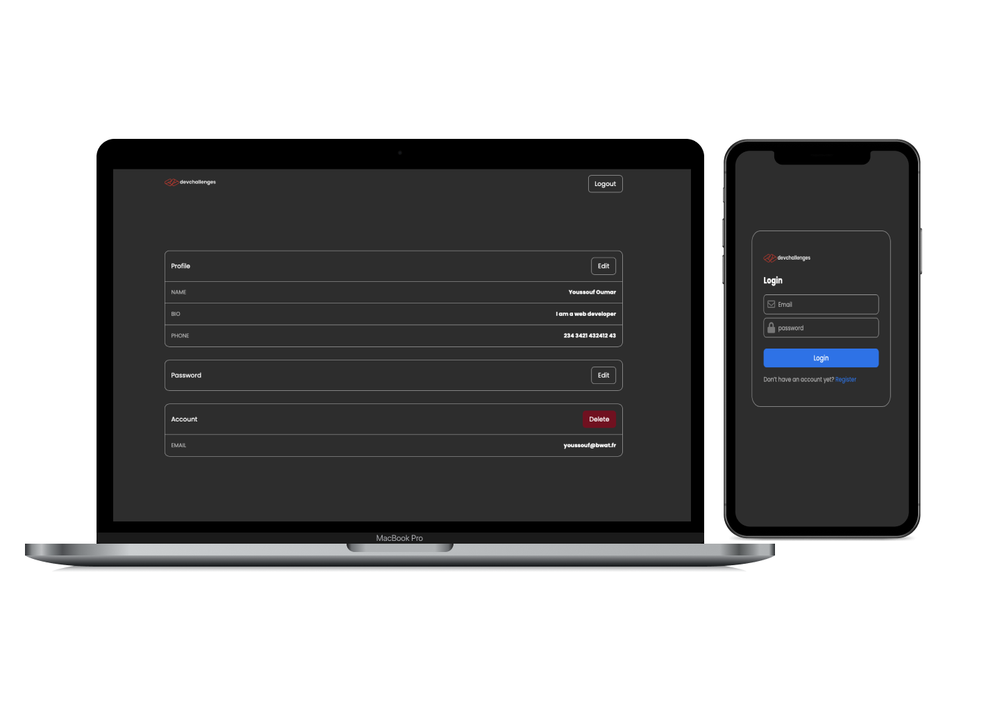

# Discord

A `Discord` clone, carried out with `React`, `Express`, `NodeJs`, `Socket.io`, `Mongoose`, `MongoDB`, and styled with `Sass`.

# Features

- I can register a new account
- I can log in
- I can sign out
- I can see my profile details
- I can edit my details including : name, bio, phone and password.
- I can delete my account
- I can reset my password with email validation
- I receive an email when I create or delete my account
- By default, I am in the Welcome channel
- I can create a new channel with a name and a description
- I can select a channel of my choice
- When I can select a channel, I am added as a member of the channel
- I can see members of the channel
- I can see online members of the channel
- I can send, edit, delete and receive messages instantly
- I see when someone is writing
- I can see other people's messages
- I can search for a group

# Overview

The project is hosted by `Heroku`. You can test it by clicking on the link above, in the `Github` about section. With the hope that, some one will find something interesting in this repository, it was your unknown friend !😉

</img>
